<div align="center">

# Terraphim Editor

**A Markdown editor for writers who keep changing their minds.**

Keep several versions of every word, sentence and paragraph, cycle between them in place, fade what you are unsure of, stash what does not fit, and let the Lab show you what to cut. Rust compiled to WebAssembly, plain JavaScript, no framework.


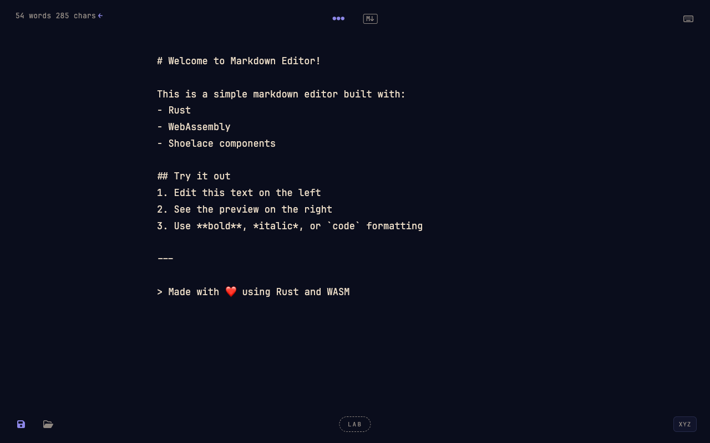

[Features](#features) ·
[Run it locally](#run-it-locally) ·
[Try it in five minutes](#try-it-in-five-minutes) ·
[Keyboard shortcuts](#keyboard-shortcuts) ·
[Embed it](#embed-it-in-a-page) ·
[Develop](#develop-and-test)

</div>

---

## Why

Drafting is mostly choosing. Ordinary editors make you delete the version you are not sure about; Terraphim Editor keeps every alternative attached to the text it belongs to, inside the Markdown file itself, so you can decide later. Nothing is rewritten without you asking, and every change is one undo step.

## Features

<table>
  <tr>
    <td width="50%" valign="top">
      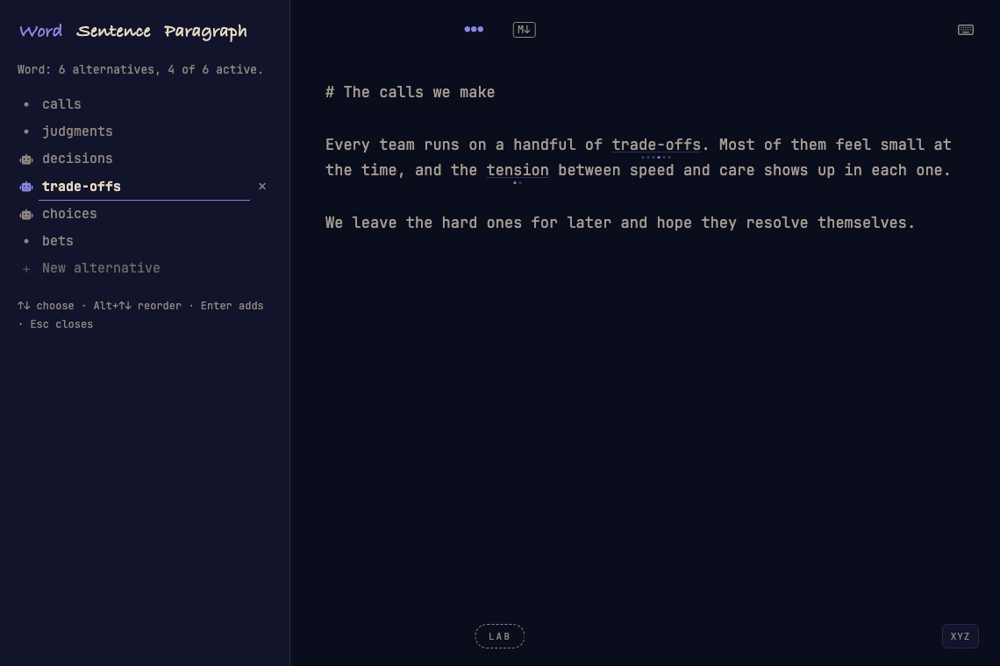
      <h3>Alternatives, in place</h3>
      Any word, sentence or paragraph can hold several versions. Dots under the text show how many and which is active; hover and press Up or Down to cycle, and "a" / "an" fix themselves. The panel lists every version, one editable line each: a dot for yours, a robot for AI or knowledge-graph lines.
    </td>
    <td width="50%" valign="top">
      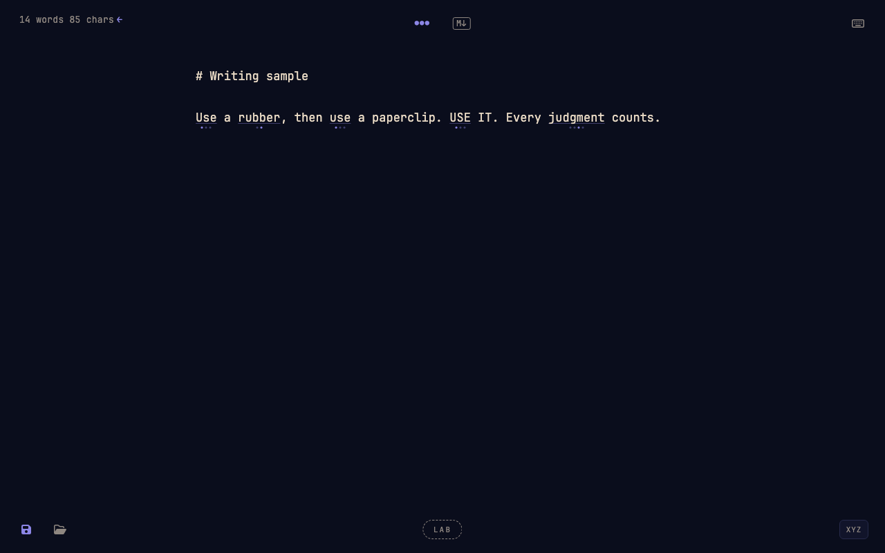
      <h3>Knowledge-graph synonyms</h3>
      Load a thesaurus and every term it knows becomes cyclable, with capitalisation kept. Matching comes from <code>terraphim_lsp_core</code>, the same engine as the Terraphim language server. These spans are derived each time and never written into your file.
    </td>
  </tr>
  <tr>
    <td width="50%" valign="top">
      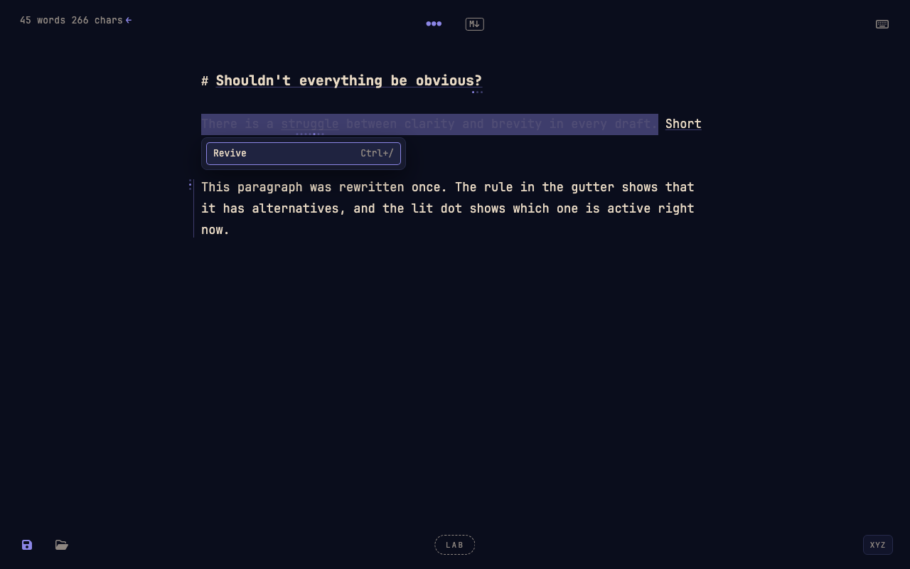
      <h3>Ghost it</h3>
      Not sure about a sentence? Fade it. Ghosted text stays editable, counted and saved, and is left out of exports. Right-click a selection for the menu, or press Ctrl+/.
    </td>
    <td width="50%" valign="top">
      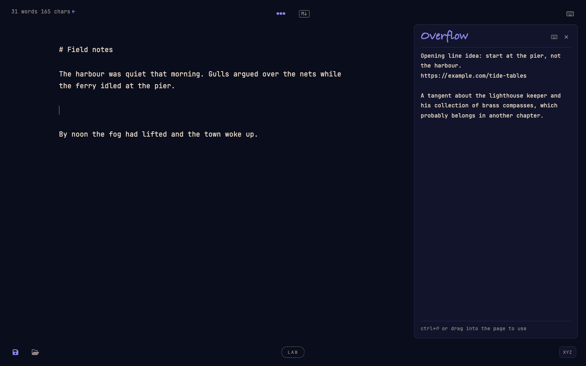
      <h3>Overflow</h3>
      A scratch area for the tangent that does not belong yet. Stash a selection there with Ctrl+Shift+X (one undo step); pull it back with Ctrl+Enter or by dragging. Saved with the document, never exported.
    </td>
  </tr>
  <tr>
    <td width="50%" valign="top">
      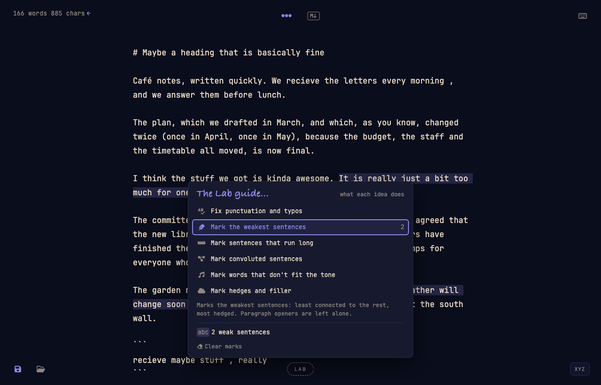
      <h3>The Lab</h3>
      Six deterministic checks that mark and never rewrite: typos and punctuation (with fixes you can accept), the weakest sentences, sentences that run long, convoluted sentences, words off the tone, and hedges and filler.
    </td>
    <td width="50%" valign="top">
      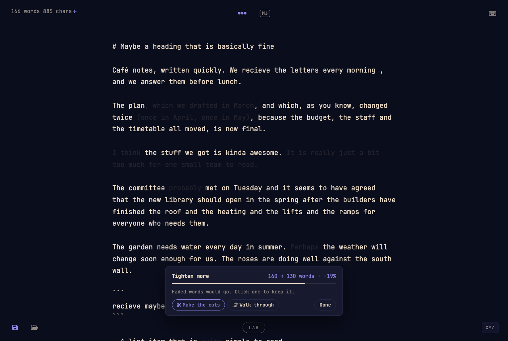
      <h3>Trim</h3>
      Ask for a 10%, 20%, 30% or 50% trim and see the cuts faded with the word count before and after. Click a cut to keep it, walk through them one by one, then make the cuts as a single undo step.
    </td>
  </tr>
  <tr>
    <td width="50%" valign="top">
      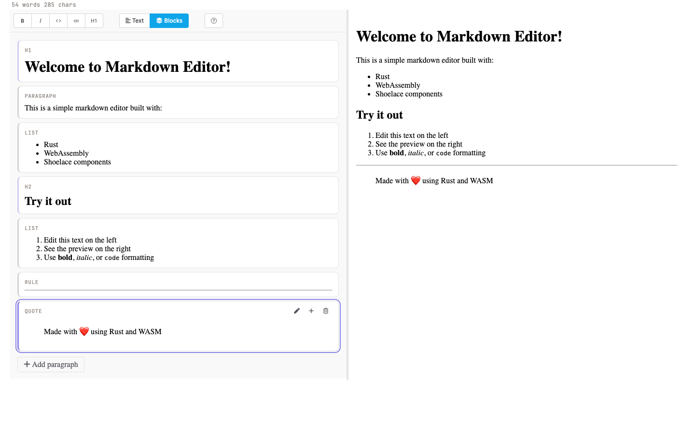
      <h3>Blocks view</h3>
      The same text as a list of cards (headings, paragraphs, lists, quotes). Edit in place, add, delete or move blocks with Alt+Up and Alt+Down; alternatives and ghosts move with them, and a half-typed draft is never lost.
    </td>
    <td width="50%" valign="top">
      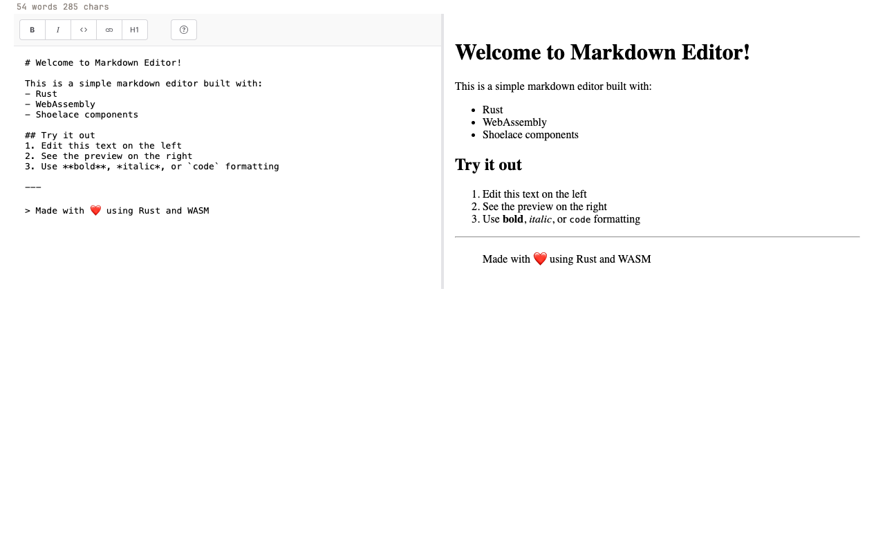
      <h3>Plain mode</h3>
      A classic source pane with a live Markdown preview, a formatting toolbar and a <code>/</code> command palette. Click the word counter to switch between plain and Write_On.
    </td>
  </tr>
  <tr>
    <td width="50%" valign="top">
      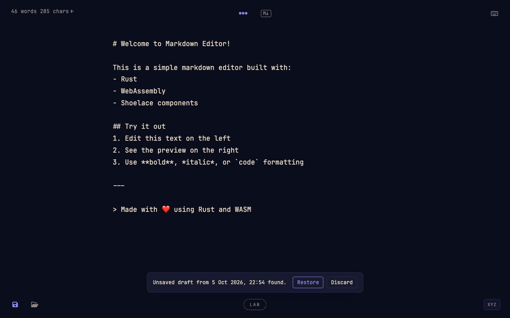
      <h3>Save and open real files</h3>
      Ctrl+S saves the document, alternatives, ghosts and overflow included, as a <code>.md</code> file: in Chrome and Edge the first save asks where and later saves write to the same file; in Firefox and Safari it downloads. Ctrl+O, the folder icon or dropping a file opens one and restores everything. A dot shows unsaved changes, and an autosaved draft survives a reload.
    </td>
    <td width="50%" valign="top">
      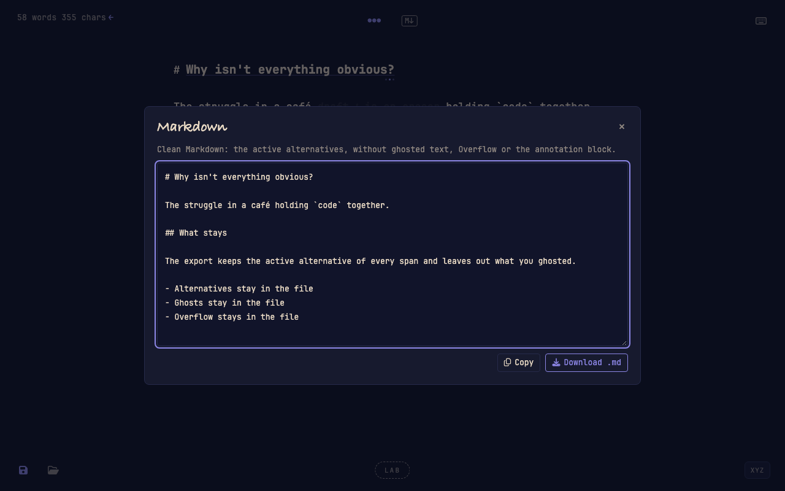
      <h3>Markdown export</h3>
      <code>M↓</code> (or the toolbar's Markdown button) shows the clean Markdown: the active alternatives, without ghosted text, the overflow or the annotation block, ready to copy or download.
    </td>
  </tr>
</table>

Your alternatives, ghosts and overflow live in a small trailing block at the end of the Markdown file:

````markdown
Every team runs on a handful of trade-offs.

```terraphim-alternatives
{"version":1,"spans":[{"id":"s1","kind":"word","anchor":{"start":32,"end":42,"text":"trade-offs"},
  "active":0,"alts":[{"text":"trade-offs","source":"original"},{"text":"choices","source":"human"}]}]}
```
````

Any Markdown viewer still shows the text; Terraphim Editor shows the alternatives.

## Run it locally

You need Rust, the WebAssembly target, Trunk, and two small Node tools that build the embeddable bundle.

**1. Toolchain**

```bash
curl --proto '=https' --tlsv1.2 -sSf https://sh.rustup.rs | sh   # Rust (skip if installed)
rustup target add wasm32-unknown-unknown
cargo install trunk wasm-pack
npm install -g terser clean-css-cli                               # used by Trunk's build hook
```

**2. Access to the Terraphim crate registry**

Some dependencies (`terraphim_automata`, `terraphim_types`, `terraphim_lsp_core` and the editor's own crates) come from the private Terraphim registry on `git.terraphim.cloud`. The repository already declares it in `.cargo/config.toml`; you only need a Gitea token with package read access:

```bash
export CARGO_REGISTRIES_TERRAPHIM_TOKEN="Bearer <your-gitea-token>"
```

**3. Clone and serve**

```bash
git clone https://github.com/terraphim/terraphim-editor.git
cd terraphim-editor
trunk serve
```

Open <http://127.0.0.1:8080>. Trunk compiles the Rust to WebAssembly, serves the page and rebuilds on every change. The first build takes a few minutes; later ones take seconds.

**4. Check everything works (optional)**

```bash
cargo test --workspace          # Rust tests
scripts/browser-tests.sh        # browser tests in headless Chrome (needs Chrome)
```

## Try it in five minutes

1. **Switch to Write_On.** Click the word counter at the top left.
2. **Add alternatives.** Select a word, press **Ctrl+Shift+A**, type another version in the panel and press Enter. Dots appear under the word.
3. **Cycle.** Close the panel (Escape), hover the word and press **Up** or **Down**.
4. **Ghost a sentence.** Select it and press **Ctrl+/**. Press it again with the caret inside to revive it.
5. **Stash a tangent.** Select a paragraph and press **Ctrl+Shift+X**; open **XYZ** at the bottom right to see it.
6. **Ask the Lab.** Click **LAB**, choose "Mark hedges and filler", then try **Tighten more** and **Make the cuts**. **Ctrl+Z** undoes the whole trim.
7. **Rearrange.** Switch to **Blocks** in plain mode and move a paragraph with **Alt+Down**.
8. **Save.** Press **Ctrl+S** (or click the floppy). In Chrome and Edge the first save asks where to put the `.md` file and later saves write to it; in Firefox and Safari it downloads. Opening it again (**Ctrl+O**, the folder icon, or dropping the file on the editor) restores every alternative, ghost and stash, and unsaved work survives a reload as a draft the editor offers to restore.

## Keyboard shortcuts

Formatting and selection shortcuts use Ctrl on every platform (not Cmd); undo, redo, save, open and Ctrl+Enter also accept Cmd. The keyboard glyph in Write_On mode shows the same reference.

<details open>
<summary><b>Writing</b></summary>

| Keys | Action |
|---|---|
| Ctrl+B / Ctrl+I | Bold / italic |
| Ctrl+K / Ctrl+L | Inline code / link |
| Ctrl+H | Heading |
| `/` | Command palette |
| Ctrl+Z / Ctrl+Y (or Cmd) | Undo / redo |
| Ctrl+S / Ctrl+O (or Cmd) | Save / open a file (replaces the browser's own) |

</details>

<details open>
<summary><b>Selection (Write_On)</b></summary>

| Keys | Action |
|---|---|
| Right-click, Menu key or Shift+F10 | Selection menu |
| Ctrl+Shift+A | Alternatives for selection |
| Ctrl+Shift+G | AI alternatives for selection (knowledge-graph synonyms) |
| Ctrl+/ | Ghost it / Revive |
| Ctrl+Shift+X | Stash this in Overflow |

</details>

<details>
<summary><b>Alternatives</b></summary>

| Keys | Action |
|---|---|
| Hover a span, Up / Down | Cycle in place (wraps round) |
| Alt+Up / Alt+Down, caret in a span | Cycle without the mouse |
| Click a dot | Jump to that alternative |
| Panel: Up / Down | Make a line active |
| Panel: Alt+Up / Alt+Down | Reorder |
| Panel: Enter on the last line | Add an alternative |
| Escape | Close the panel |

</details>

<details>
<summary><b>Overflow, Lab and trim</b></summary>

| Keys | Action |
|---|---|
| XYZ (bottom right) | Open or close Overflow |
| Ctrl+Enter in Overflow | Insert the selection (or current line) at the caret |
| LAB (bottom centre) | Open the Lab; Up / Down, Home / End move between actions |
| Walk through: Left / Right, K, Escape | Previous / next cut, keep it, stop |

</details>

<details>
<summary><b>Blocks view</b></summary>

| Keys | Action |
|---|---|
| Up / Down, Home / End | Move between cards |
| Enter or F2 | Edit the block |
| Shift+Enter | Add a paragraph below |
| Delete | Delete the block |
| Alt+Up / Alt+Down | Move the block |
| Ctrl+Enter / Escape (editing) | Commit / close (typed text is kept in the drafts notice) |

</details>

## Embed it in a page

`trunk build --release` writes an embeddable bundle next to the standalone page in `target/trunk-dist`: `terraphim-editor.min.js`, `terraphim-editor.min.css`, the WebAssembly module (`terraphim_editor.js` and `terraphim_editor_bg.wasm`) and a working `example.html`. Serve those files from one directory and a page with nothing but a container gets the whole editor, Write_On chrome, alternatives, Lab, Blocks, Overflow and save/open included:

```html
<link rel="stylesheet" href="https://cdnjs.cloudflare.com/ajax/libs/font-awesome/6.5.2/css/all.min.css">
<link rel="stylesheet" href="terraphim-editor.min.css">
<div id="editor" style="height: 80vh"></div>
<script src="terraphim-editor.min.js"></script>
<script type="module">
  const editor = await TeraphimEditor.create(document.getElementById('editor'), {
    value: '# Hello',
    // wasmUrl / glueUrl: only if the module is not next to the script
    // standalone: true: Ctrl+S / Ctrl+O anywhere on the page
  });
  editor.setValue('# Hello again');
  editor.on('te:saved', (event) => console.log(event.detail.text));
</script>
```

The editor object has `getValue()`, `setValue()`, `openDocument(text, name)`, `saveDocument()` (Markdown plus the annotation block), `exportDocument()` (clean Markdown), `isWriteOn()` / `setWriteOn()`, `on()` / `off()` for its `te:*` events, `persistence` and `destroy()`. Shoelace is loaded from its CDN; link FontAwesome yourself, as above. One editor per page: the document model lives in the WebAssembly module as a single instance, so a second `create()` is refused until the first is destroyed. Write_On themes the editor's own container and never restyles the host page; its corner controls sit in the viewport corners, so give the editor most of the page. Design notes: `docs/design/embedding.md`.

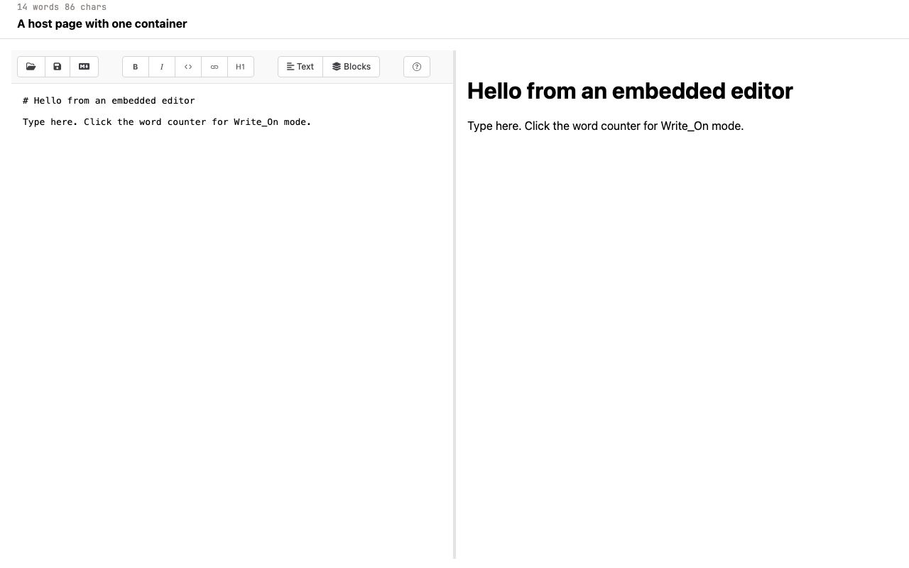

The standalone page (`index.html`) creates its editor on load and exposes it as `window.terraphimEditor`; with the embed, use the object `create()` returns. Either way a host script can take over storage:

```html
<script>
  document.addEventListener('te:save', (event) => {
    event.preventDefault(); // store documents yourself instead of a file
    const text = window.terraphimEditor.saveDocument(); // Markdown plus annotation block
    fetch('/documents/draft.md', { method: 'PUT', body: text })
      .then(() => window.terraphimEditor.persistence.markClean());
  });

  document.addEventListener('te:open', (event) => {
    event.preventDefault();
    fetch('/documents/draft.md')
      .then((response) => response.text())
      .then((text) => window.terraphimEditor.openDocument(text, 'draft.md'));
  });
</script>
```

`te:save`, `te:open` and `te:markdown` (the `M↓` control) bubble to `document` and are cancelable; without `preventDefault()` the editor saves to a file or download, opens a file, and shows the export dialog. `te:saved` carries the serialised document (`detail.text`) whenever the editor saves; `te:written`, `te:opened`, `te:dirty-change`, `te:mode-change` and `te:blocks-drafts` report what happened. `exportDocument()` returns the clean Markdown. Set `fileSystemAccess: false` in the editor config to always download instead of using the browser's file picker. In an embedding page Ctrl+S and Ctrl+O act only while focus is in the editor, so the host's own shortcuts keep working; `standalone: true` (what the standalone page sets) makes them act anywhere. Design notes: `docs/design/persistence.md`.

## How it is built

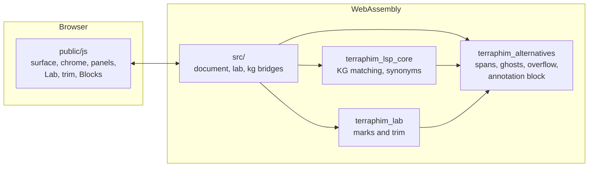

The Rust model is the source of truth: every edit goes to it first, and the surface follows, so undo and redo restore text and annotations together.

| Path | Contents |
|---|---|
| `src/` | WebAssembly entry point, Markdown rendering, the document, Lab and knowledge-graph bridges |
| `crates/terraphim_alternatives` | The span model, annotation block, re-anchoring, moves and the shared word count |
| `crates/terraphim_lab` | The Lab engine: mark actions and trim |
| `public/js/`, `public/css/` | The editor surface and features (including save, open and export); design tokens |
| `docs/requirements/`, `docs/design/` | Specification and per-feature design notes |
| `tests/` | Native tests and the browser test binaries (`web_*.rs`) |

## Develop and test

| Command | What it does |
|---|---|
| `trunk serve` | Development server with live rebuild at <http://127.0.0.1:8080> |
| `cargo test --workspace` | Rust unit and integration tests |
| `scripts/browser-tests.sh` | Every browser test binary in headless Chrome, one at a time, with a time and load table; waits for the machine to settle and skips the benchmarks under heavy load (exit code 3) |
| `wasm-pack test --headless --chrome --test web_kg` | A single browser test binary |
| `cargo clippy --workspace --all-targets -- -D warnings` | Lints (also run with `--target wasm32-unknown-unknown --lib --tests`) |
| `cargo bench` | Criterion benchmarks |
| `scripts/release-dist.sh` | Regenerate the committed release copy in `dist/` |

Browser tests drive the real DOM and the real WebAssembly bindings; there are no mocks. Development builds write to `target/trunk-dist`; `dist/` changes only through `scripts/release-dist.sh`.

## Contributing

Work is tracked in Gitea issues at git.terraphim.cloud. Create a branch per issue (`task/<number>-<short-title>`), keep each change one undo step for the writer, and open a pull request against `main`.

## Licence

MIT. See [LICENSE](LICENSE).
